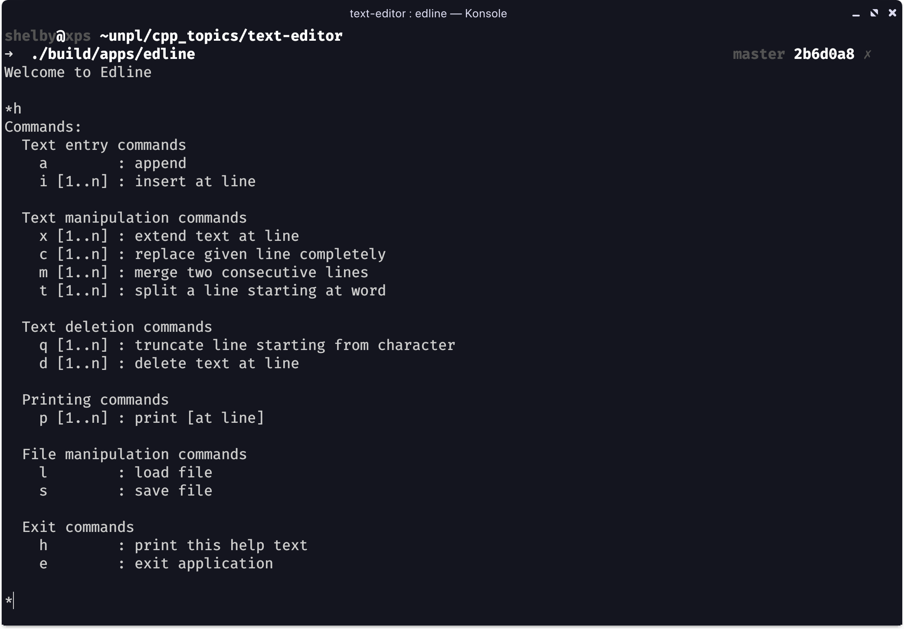

### Edlin Text Editor

Edlin is one of the oldest text editors to date. This project is a school assignment and a spinoff of the MS-DOS line editor Edlin. The text editor offers basic commands for inserting, removing, merging, etc. lines. The full usage description can be found below.


## Installation

#### cloning and building from source
```bash
git clone https://github.com/shleppy/edlin-text-editor.git
cd edlin-text-editor
make
```

The application is now installed under _build/apps/edlin_.  

#### run
running from the root directory:
```bash
./build/apps/edlin
```

_Note: I know this may not be optimal at the moment, but the application is currently only a school assignment and will therefore currently remain in a testing state._ 

## Usage

### Help command output



### Commands

#### Basic commands
| Name | Command | Optional parameter | User action | Result |
|----------|----------|-----------|---------|---------|
| Append | a | - | Type line | Line appended |
| Insert | i | Line number | Type line | Line inserted |
| Delete | d | Line number | - | Line deleted |
| Delete last line | z | - | - | Last line removed |
| Print | p | Line number | - | Text printed on screen |

#### Advanced commands
| Name | Command | Optional parameter | User action | Result |
|----------|----------|-----------|---------|---------|
| Replace line | c | Line number | Type replacement text | Line replaced | 
| Truncate from char | q | Line number | - | Line truncated |
| Merge consecutive lines | m | Line number | - | Line merged with next line |
| Extend | x | Line number | Type text | Text appended to line |
| Undo | u | - | - | Last command is undone* |
| Redo | r | - | - | Last undone command is redone** |

#### Useful commands
| Name | Command | Optional parameter | User action | Result |
|----------|----------|-----------|---------|---------|
| Load | l | Filename | Type filename | File loaded |
| Save | s | Filename | Type filename | File saved |
| Help | h | - | - | Prints a help menu |
| Quit | e | - | - | Exits the application |


\*Last known command that is undoable (e.g. append, insert, delete, truncate, merge, etc.)  
\*\*Last undone command that is known. Resets after any command has been entered.  

## Extra information
#### General application info
* If the optional line numbers for certain commands are not passed the application assumes the current line (probably last line).  
* All advanced commands were optional assignments and therefor won't be checked on correctness.  
* PR are welcome
* Improvement tips are welcome
* Donations for a software engineering student are welcome

#### Assignment information
The assignment is the first assignment for the course unmanaged programming languages(UNPL).
Goals:  
* Learning C++
* Dynamic memory allocation
* Pass by value, reference, address
* Data structures
* Purpose is an intermediate assignment in a new topic(unmanaged programming)

Requirements:  
* declaration and implementation seperated in .h and .cpp files
* use of make
* internal structure should be singly linked list with both dummy header and footer
* general preconditions following the use-case descriptions, class diagram and sequence diagrams.(not included here)

